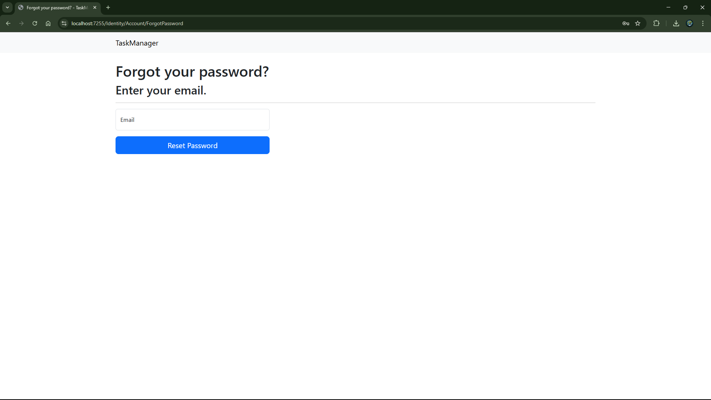
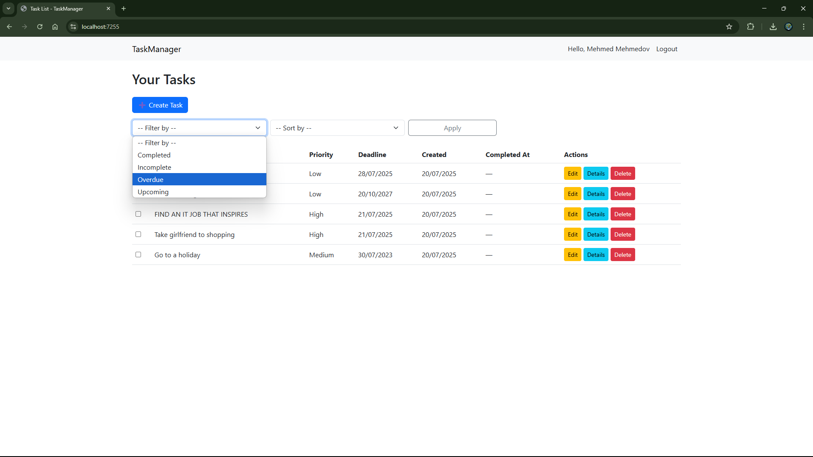

# 📝 TaskManager MVC App

A full-featured task management web application built using **ASP.NET Core MVC (.NET 8)** and **Entity Framework Core**.  
This project was developed as a portfolio piece to demonstrate practical skills in full-stack .NET development.

---

## 📌 What the Project Does

TaskManager is a simple yet powerful to-do list app that allows registered users to:

- ✅ Create, update, and delete personal tasks  
- ✅ Mark tasks as completed via checkbox (AJAX)  
- ✅ Set priorities and optional deadlines  
- ✅ Filter and sort tasks (e.g., by status, deadline, creation date)  
- ✅ Track when tasks were created or completed  
- ✅ Edit tasks directly from the list (inline editing)  
- ✅ Register and log in securely using ASP.NET Identity  

---

## 🌟 Why the Project Is Useful

This app shows a realistic example of how .NET 8 MVC apps are structured with user authentication, entity relationships, AJAX interactivity, and clean UI.  
It’s a great starting point for beginners and a solid codebase to build on for job seekers or hobby projects.

---

## 🚀 How to Get Started

### ✅ Requirements

- [.NET 8 SDK](https://dotnet.microsoft.com/en-us/download/dotnet/8.0)
- Visual Studio 2022+ (or Visual Studio Code)

### ⚙️ Setup Steps

1. Clone the repository:
   ```bash
   git clone https://github.com/your-username/TaskManagerMvc.git
   cd TaskManagerMvc
   ```

2. Apply database migrations:
   ```bash
   dotnet ef database update
   ```

3. Run the app:
   ```bash
   dotnet run
   ```

4. Visit the site in your browser:
   ```
   https://localhost:xxxx/
   ```

---

## ❓ Where to Get Help

- Open an issue or discussion on this repo
- Contact me on LinkedIn: [Mehmed Mehmedov](https://linkedin.com)
- Email: your.email@example.com

---

## 👥 Who Maintains This Project

**Mehmed Mehmedov**  
.NET Developer | Computer Science Graduate  
GitHub: [github.com/your-username](https://github.com/your-username)

---

## 🛠️ Built With

- ASP.NET Core MVC (.NET 8)
- Entity Framework Core
- ASP.NET Identity
- SQLite
- Bootstrap 5
- AJAX (for inline UI updates)

---

## 📸 Demo Preview

Below are some screenshots showcasing the TaskManager app:

  
*User registration page for creating a new account.*

  
*Login interface for secure user authentication.*

  
*Form for resetting a user's password.*

  
*Confirmation screen after requesting a password reset.*

  
*Main task list view with all tasks displayed.*

  
*Form for creating a new task with priority and deadline fields.*

  
*Alternate view of the task creation form.*

  
*Alternate view of the main task list.*

  
*Interface for filtering tasks by status or other criteria.*

  
*Task list showing results after applying filters.*

  
*Interface for sorting tasks by deadline, creation date, or priority.*

  
*Task list showing results after applying sorting.*

  
*View of a task marked as completed.*

  
*Inline editing feature for quick task updates.*

  
*Detailed view of a specific task.*

  
*Confirmation prompt for deleting a task.*

---

## 📜 License

This project is licensed under the **MIT License** — free to use, improve, and adapt.
